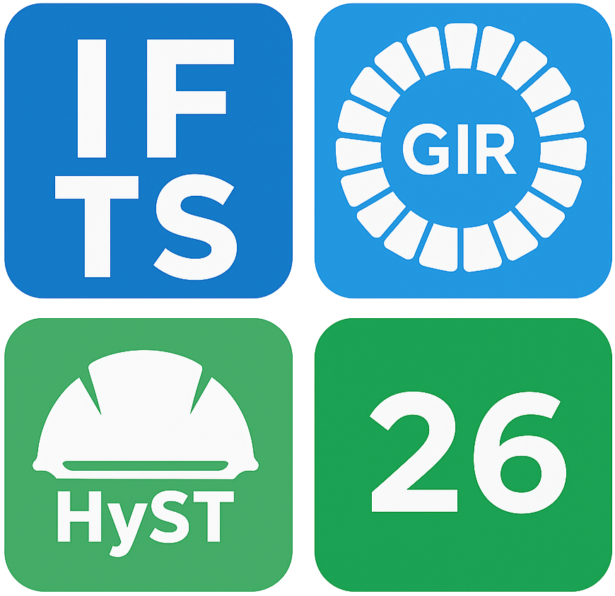

# IFTS N°26 - Sitio Web Institucional

<div align="center">



**Sitio web oficial del Instituto de Formación Técnica Superior N°26**

📍 Estados Unidos 3141, Ciudad Autónoma de Buenos Aires

[Sitio Web](https://ifts26.netlify.app/) | [Facebook](https://www.facebook.com/ifts26) | [Instagram](https://www.instagram.com/ifts_26/)

</div>

---
## Trabajo Colaborativo

Este proyecto fue desarrollado en equipo por:

<table align="center">
  <tr>
    <td align="center">
      <sub><b>Federico Osorio</b></sub><br />
      <a href="https://www.linkedin.com/in/fedeosorio/">LinkedIn</a>
    </td>
    <td align="center">
      <sub><b>Marcos Toledo</b></sub><br />
      <a href="https://www.linkedin.com/in/marcos-ezequiel-toledo/">LinkedIn</a>
    </td>
  </tr>
</table>

---

## Descripción del Proyecto

Este es el **sitio web institucional renovado** del IFTS N°26, desarrollado como proyecto colaborativo con el objetivo de modernizar la presencia digital del instituto y facilitar el acceso a la información para estudiantes, docentes y aspirantes.

El sitio centraliza toda la información relevante sobre:
- **Carreras técnicas** ofrecidas (GIR y HyS)
- **Información para alumnos** (horarios, mesas de examen, trámites, becas)
- **Recursos para docentes** (planillas, programas, material didáctico)
- **Datos institucionales** (autoridades, calendario académico, reglamento)
- **Accesos directos** a sistemas (SIU Guaraní, Moodle)
- **Contacto y ubicación** del instituto

---

## Características Principales

### Para Estudiantes
- Consulta de horarios de cursada actualizados
- Fechas de mesas de examen y turnos de inscripción
- Información sobre becas, trámites y constancias
- Acceso rápido a SIU Guaraní y plataforma Moodle
- Preguntas frecuentes y sistema de tutorías

### Para Docentes
- Planillas de asistencia y notas descargables
- Repositorio de programas de cátedra
- Enlaces a recursos institucionales (Google Drive)
- Material didáctico organizado por materia

### Información Institucional
- Calendario académico actualizado
- Datos de autoridades y personal
- Reglamento orgánico y normativas
- Plano de evacuación en caso de emergencias

### Experiencia de Usuario
- Diseño moderno y responsive (mobile, tablet, desktop)
- Navegación intuitiva y accesible
- Carga rápida de contenido
- Compatibilidad con todos los navegadores modernos
- Formulario de contacto funcional
- Integración con Google Maps para ubicación

---

## Tecnologías Utilizadas

### Frontend
- **[Angular 20.3](https://angular.io/)** - Framework principal de desarrollo
- **[TypeScript 5.7](https://www.typescriptlang.org/)** - Lenguaje de programación
- **[SCSS](https://sass-lang.com/)** - Preprocesador CSS para estilos avanzados
- **[FontAwesome](https://fontawesome.com/)** - Biblioteca de iconos
- **[Bootstrap Icons](https://icons.getbootstrap.com/)** - Iconos complementarios

### Arquitectura
- **Componentes Standalone** - Arquitectura moderna sin NgModules
- **Reactive Forms** - Manejo robusto de formularios
- **Router** - Navegación SPA (Single Page Application)
- **RxJS** - Programación reactiva
- **Signals** - Nueva API de reactividad de Angular

### Herramientas de Desarrollo
- **[Angular CLI](https://cli.angular.io/)** - Generación y gestión del proyecto
- **[Node.js](https://nodejs.org/)** - Entorno de ejecución
- **[npm](https://www.npmjs.com/)** - Gestor de paquetes
- **[Git](https://git-scm.com/)** - Control de versiones

### Deployment
- **[Netlify](https://www.netlify.com/)** - Hosting y despliegue continuo
- **CI/CD** - Despliegue automático desde GitHub

---

## Estructura del Proyecto

```
IFTS26/
├── src/
│   ├── app/
│   │   ├── components/         # Componentes reutilizables
│   │   │   ├── header/         # Barra de navegación
│   │   │   ├── footer/         # Pie de página
│   │   │   ├── page-banner/    # Banner de páginas internas
│   │   │   └── ...
│   │   │
│   │   ├── pages/              # Páginas completas
│   │   │   ├── home/           # Página de inicio
│   │   │   ├── navegacion/     # Páginas agrupadas
│   │   │   │   ├── alumnos/    # Sección de alumnos
│   │   │   │   ├── carreras/   # Información de carreras
│   │   │   │   ├── docentes/   # Recursos para docentes
│   │   │   │   └── ...
│   │   │   └── not-found/      # Página 404
│   │   │
│   │   ├── app.ts              # Componente raíz
│   │   ├── app.config.ts       # Configuración global
│   │   └── app.routes.ts       # Definición de rutas
│   │
│   ├── assets/                 # Recursos estáticos
│   │   ├── data/               # Archivos JSON con contenido
│   │   └── images/             # Imágenes del sitio
│   │
│   ├── styles/                 # Estilos globales
│   │   └── _variables.scss     # Variables SCSS
│   │
│   └── main.ts                 # Punto de entrada
│
├── public/                     # Archivos públicos
│   └── assets/
│       └── img/                # Logos e imágenes públicas
│
├── GUIA.md                     # Guía detallada para desarrolladores
├── README.md                   # Este archivo
└── package.json                # Dependencias del proyecto
```

---

## Instalación y Uso

### Requisitos Previos
- Node.js 18 o superior
- npm 9 o superior
- Angular CLI 20 o superior

### Instalación Local

```bash
# Clonar el repositorio
git clone https://github.com/tu-usuario/ifts26.git

# Entrar al directorio
cd ifts26

# Instalar dependencias
npm install

# Iniciar servidor de desarrollo
npm start
```

La aplicación estará disponible en `http://localhost:4200/`

### Comandos Disponibles

```bash
# Desarrollo
npm start              # Inicia servidor de desarrollo
npm run build          # Compila para producción
npm test               # Ejecuta tests

# Generación de código
ng generate component pages/nueva-pagina
ng generate service services/nuevo-servicio
```
---

## Documentación para Desarrolladores

Si eres nuevo en el proyecto o en Angular, **revisa el archivo [GUIA.md](./GUIA.md)** que incluye:

- Explicación detallada de la arquitectura
- Conceptos clave de Angular y TypeScript
- Ejemplos de código comentados línea por línea
- Guías paso a paso para agregar nuevas páginas
- Instrucciones para modificar estilos
- Solución a problemas comunes (troubleshooting)

---

## Cómo Contribuir

¿Querés ayudar a mejorar el sitio del IFTS26? ¡Toda contribución es bienvenida!

### Proceso de Contribución

1. **Fork** el repositorio
2. Creá una **rama nueva** para tu feature (`git checkout -b feature/nueva-funcionalidad`)
3. **Commiteá** tus cambios (`git commit -m 'Agrego nueva funcionalidad'`)
4. **Pusheá** a la rama (`git push origin feature/nueva-funcionalidad`)
5. Abrí un **Pull Request** describiendo los cambios

### Guías de Código

- **Comentarios:** Todos los archivos TypeScript deben tener comentarios en español argentino formal
- **Nombres:** Variables y funciones en español, clases en PascalCase, variables en camelCase
- **Estilos:** Usar SCSS con variables definidas en `_variables.scss`
- **Responsive:** Todos los componentes deben funcionar en mobile, tablet y desktop
- **Accesibilidad:** Seguir estándares WCAG 2.1 (etiquetas alt, contraste de colores, navegación por teclado)

---

## Licencia

Este proyecto está bajo la licencia MIT. Ver el archivo [LICENSE](./LICENSE) para más detalles.

---

## Contacto

**IFTS N°26**
- Estados Unidos 3141, C1228ABC, Ciudad Autónoma de Buenos Aires
- 4931-9843 / 4932-6210
- Horario de atención: 18:30 a 21:00 hs
- **GIR:** tecnicaturagir@yahoo.com
- **HyS:** tecnicaturaenseguridadhigiene@yahoo.com.ar
- [Sitio Web](https://ifts26.netlify.app/)
- [Facebook](https://www.facebook.com/ifts26)
- [Instagram](https://www.instagram.com/ifts_26/)

---

<div align="center">

**Hecho con dedicación para la comunidad del IFTS N°26**

Si te resultó útil este proyecto, considerá darle una estrella en GitHub

</div>